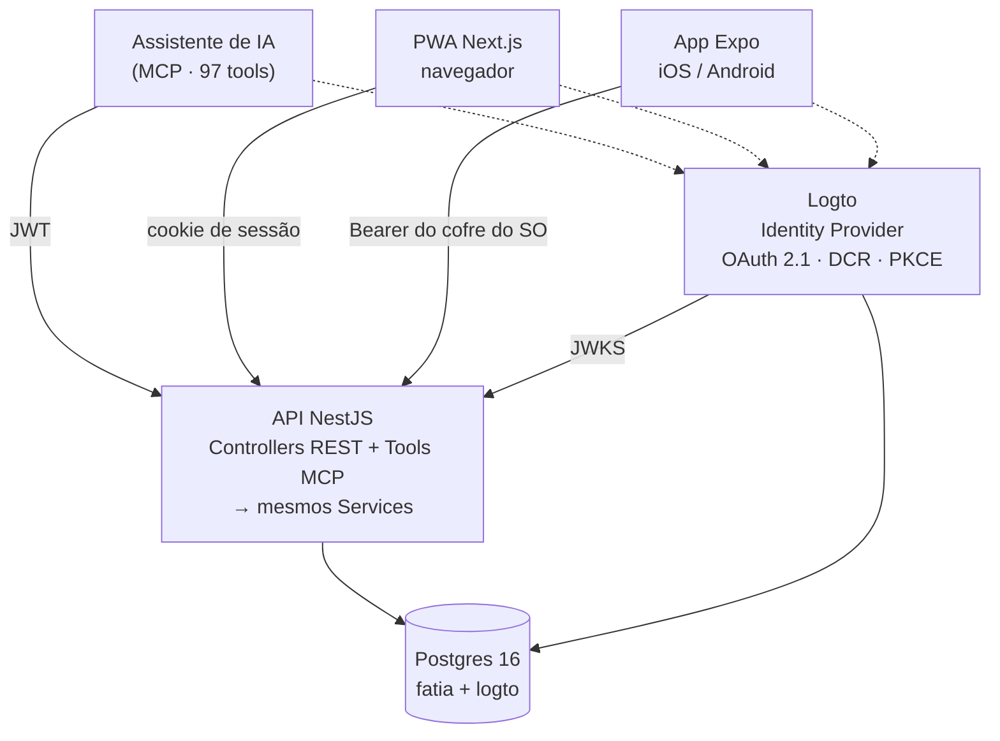

# Fatia

**Rastreador de nutrição e treino self-hosted, MCP-first.** Você sobe a stack no seu servidor, os dados ficam no seu Postgres, e a interface principal é o seu assistente de IA — não um app.

[](https://github.com/ThiagoCarreiraVallim/fatia/actions/workflows/ci.yml)
[](https://github.com/ThiagoCarreiraVallim/fatia/actions/workflows/secret-scan.yml)
[](LICENSE)
[](.nvmrc)
[](CONTRIBUTING.md)

## Para quem é

- Quem quer **controle total dos próprios dados** de saúde — sem SaaS no meio, sem exportação bloqueada por plano pago.
- Quem prefere **conversar** com o app ("comi 200 g de frango com arroz", "supino 4×10 com 60 kg") a preencher formulário.
- Quem está confortável em **self-hostar**: um `docker compose` num VPS já é o suficiente.

Se você quer instalar um app na loja e não pensar em servidor, o Fatia ainda não é para você.

## O que o torna diferente

|                                           |                                                                                                                                                                                                          |
| ----------------------------------------- | -------------------------------------------------------------------------------------------------------------------------------------------------------------------------------------------------------- |
| **MCP-first, não "com integração de IA"** | As **97 tools** MCP cobrem o CRUD inteiro da aplicação. Não existe operação que o PWA faça e o MCP não faça. A tela é a camada opcional, e não o contrário.                                              |
| **Os dados são seus**                     | Postgres seu, servidor seu, licença MIT. `export_my_data` devolve tudo, `delete_my_account` apaga tudo — as duas expostas como tool, para você exercer o direito sem pedir a ninguém.                    |
| **Foto não vira arquivo**                 | O assistente analisa a imagem da refeição e manda **dados estruturados**. O Fatia nunca armazena a foto ([ADR 004](docs/ADR/004-sem-armazenamento-fotos.md)).                                            |
| **Base nutricional brasileira**           | Os **597 alimentos da TACO** (NEPA/Unicamp) já vêm no seed, com macros e micronutrientes. Mais **873 exercícios** com músculos primários e secundários.                                                  |
| **Identidade self-hosted**                | Auth via [Logto](https://logto.io) no seu próprio container — OAuth 2.1 com DCR e PKCE, exigência do conector remoto. A API só valida JWT, nunca emite ([ADR 008](docs/ADR/008-logto-oidc-provider.md)). |
| **Um compose e acabou**                   | `infra/docker-compose.prod.yml` sobe API, PWA, site e Logto atrás do Traefik, com SSL automático.                                                                                                        |

## Arquitetura em um relance



**Regra de ouro:** tool MCP e endpoint REST que fazem a mesma coisa delegam para o **mesmo método de service**. Lógica de negócio nunca mora no controller nem na tool.

**Por que MCP-first?** [`docs/ADR/006-mcp-first.md`](docs/ADR/006-mcp-first.md). Em resumo: o uso real é pelo celular, conversando — então toda funcionalidade tem de estar disponível por lá.

> 📸 Capturas de tela do PWA e da conversa via MCP estão pendentes — dependem de uma instância com dados reais. Acompanhe em [#208](https://github.com/ThiagoCarreiraVallim/fatia/issues/208).

## Quick start

Pré-requisitos: Node 24+ (`nvm use`), Docker, e `corepack enable` (para o pnpm 9 pinado em `packageManager`).

```bash
git clone https://github.com/ThiagoCarreiraVallim/fatia.git
cd fatia
pnpm bootstrap   # uma vez: corepack + install + migrate + seed
pnpm dev         # diário: sobe postgres + logto + API + Web com hot reload
```

API em `http://localhost:3000`, Web em `http://localhost:3030`, MCP em `http://localhost:3000/mcp`.

Próximos passos:

- **Rodar e contribuir** → [`docs/ONBOARDING.md`](docs/ONBOARDING.md)
- **Subir o auth (Logto) local** → [`docs/LOCAL_AUTH.md`](docs/LOCAL_AUTH.md)
- **Testar MCP tools com Claude / clientes open-source** → [`docs/MCP_LOCAL.md`](docs/MCP_LOCAL.md)
- **Rodar o app nativo no celular** → [`apps/mobile/README.md`](apps/mobile/README.md)
- **Colocar em produção** → [`infra/dokploy/README.md`](infra/dokploy/README.md)

## Roadmap

O planejamento é público e vive nas **[Issues](https://github.com/ThiagoCarreiraVallim/fatia/issues)**, organizadas em épicas com sub-issues nativas (o painel de progresso de cada épica é gerado pelo próprio GitHub). Nada de checklist em markdown — [já tentamos, e apodreceu](docs/TASKS.md).

Em andamento:

| Épica                                                            | Assunto                                                              |
| ---------------------------------------------------------------- | -------------------------------------------------------------------- |
| [#38](https://github.com/ThiagoCarreiraVallim/fatia/issues/38)   | Virar conector oficial do Claude — OAuth, hardening, LGPD, submissão |
| [#133](https://github.com/ThiagoCarreiraVallim/fatia/issues/133) | Fundação de IA — gateway, custo e privacidade                        |
| [#137](https://github.com/ThiagoCarreiraVallim/fatia/issues/137) | Nutrição com IA — foto, código de barras, voz, porção                |
| [#143](https://github.com/ThiagoCarreiraVallim/fatia/issues/143) | Treino inteligente — prescrição adaptativa e periodização            |
| [#146](https://github.com/ThiagoCarreiraVallim/fatia/issues/146) | Engajamento — streaks, conquistas, notificações                      |
| [#149](https://github.com/ThiagoCarreiraVallim/fatia/issues/149) | Dados e integrações — base internacional e wearables                 |
| [#152](https://github.com/ThiagoCarreiraVallim/fatia/issues/152) | Camada B2B — grupos, academias, papéis e cobrança                    |
| [#163](https://github.com/ThiagoCarreiraVallim/fatia/issues/163) | BYO-AI — o usuário traz a própria IA                                 |

O mapa completo, incluindo o que já foi entregue, está em [`docs/TASKS.md`](docs/TASKS.md).

## Contribuindo

PRs são bem-vindas. O guia completo — setup, convenção de commit, fluxo de branch, labels — está em [**`CONTRIBUTING.md`**](CONTRIBUTING.md).

- Procurando por onde começar? [`good first issue`](https://github.com/ThiagoCarreiraVallim/fatia/labels/good%20first%20issue) e [`help wanted`](https://github.com/ThiagoCarreiraVallim/fatia/labels/help%20wanted).
- Dúvida, ideia ou proposta grande? Abra uma [issue](https://github.com/ThiagoCarreiraVallim/fatia/issues/new/choose) **antes** de codar — evita trabalho jogado fora.
- Achou uma vulnerabilidade? **Não abra issue pública.** Siga o [`SECURITY.md`](SECURITY.md).

Duas regras da casa que economizam ida e volta no review:

1. **Isolamento entre contas é 100% da aplicação.** Não há RLS no Postgres ([ADR 010](docs/ADR/010-row-level-security.md)) — todo id que chega por input tem de ser amarrado ao usuário autenticado, e recurso alheio responde `NOT_FOUND`, nunca `403`.
2. **Prove o vermelho.** Teste que protege uma correção precisa falhar sem a correção. Cole a evidência na PR.

## Desenvolvimento assistido por IA

Parte deste repositório é escrita com assistentes de código, e os arquivos que os configuram são versionados de propósito — quem quiser reproduzir o fluxo consegue; quem não usa, ignora.

| Caminho                                                   | O que é                                                                             | Preciso ler?                                                |
| --------------------------------------------------------- | ----------------------------------------------------------------------------------- | ----------------------------------------------------------- |
| [`docs/CLAUDE.md`](docs/CLAUDE.md)                        | Regras de código, arquitetura e teste, no formato que assistentes carregam sozinhos | Não. É um recorte do `CONTRIBUTING.md` + ADRs, para máquina |
| [`docs/_archive/superpowers/`](docs/_archive/superpowers) | Planos e specs gerados por agente em refatorações já concluídas                     | Não. Registro histórico                                     |
| [`docs/_archive/plans/`](docs/_archive/plans)             | Planos de fase escritos à mão, todos concluídos                                     | Não. Registro histórico                                     |

`.claude/` **não é versionado** — é ferramenta pessoal do mantenedor e não está no repositório.

Contribuição gerada por IA é aceita nas mesmas condições de qualquer outra: você entende o que enviou, os testes provam o vermelho, e a PR passa pelo mesmo review.

## Documentação

| Arquivo                                          | Conteúdo                                                                           |
| ------------------------------------------------ | ---------------------------------------------------------------------------------- |
| [`CONTRIBUTING.md`](CONTRIBUTING.md)             | Como contribuir: setup, commits, branches, labels, review                          |
| [`SECURITY.md`](SECURITY.md)                     | Política de segurança e como reportar vulnerabilidade                              |
| [`docs/ONBOARDING.md`](docs/ONBOARDING.md)       | Setup local, scripts, modos de desenvolvimento, troubleshooting                    |
| [`docs/LOCAL_AUTH.md`](docs/LOCAL_AUTH.md)       | Logto local: tenant, apps, API resource, `.env`                                    |
| [`docs/MCP_LOCAL.md`](docs/MCP_LOCAL.md)         | Registrar o MCP local no Claude Desktop / Code / clientes open-source + smoke test |
| [`docs/PRD.md`](docs/PRD.md)                     | Product Requirements — o que é o produto, escopo, não-escopo                       |
| [`docs/ARCHITECTURE.md`](docs/ARCHITECTURE.md)   | Arquitetura técnica, stack, decisões                                               |
| [`docs/DESIGN.md`](docs/DESIGN.md)               | UX, telas do PWA, fluxos                                                           |
| [`apps/mobile/README.md`](apps/mobile/README.md) | Rodar o app nativo localmente, configuração, troubleshooting                       |
| [`docs/MOBILE_PARITY.md`](docs/MOBILE_PARITY.md) | Paridade entre o app nativo e o PWA, rota a rota e componente a componente         |
| [`docs/MCP.md`](docs/MCP.md)                     | Especificação das tools MCP expostas                                               |
| [`docs/THREAT_MODEL.md`](docs/THREAT_MODEL.md)   | Modelo de ameaças e decisões de isolamento                                         |
| [`docs/OPERATIONS.md`](docs/OPERATIONS.md)       | Runbook de produção, backup e recuperação de desastre                              |
| [`docs/TASKS.md`](docs/TASKS.md)                 | Mapa das épicas — o planejamento em si vive nas Issues                             |
| [`docs/ADR/`](docs/ADR/)                         | Architecture Decision Records                                                      |

## Estrutura

```
fatia/
├── apps/
│   ├── api/           # NestJS (REST + MCP)
│   ├── web/           # Next.js PWA
│   ├── mobile/        # React Native (Expo) — réplica nativa do PWA
│   └── site/          # Astro — landing e documentação pública
├── packages/
│   ├── api-client/    # cliente de API compartilhado entre web e mobile
│   └── db/            # Prisma schema + client compartilhado
├── infra/             # docker-compose, Dockerfiles, backup
├── scripts/           # setup, dev, smoke test do MCP, varredura de segredo
└── docs/              # Documentação
```

`packages/api-client` existe para que o PWA e o app nativo falem com a API pelo **mesmo** código. O que muda entre eles é só o transporte: o web passa pelo proxy do Next (o token fica no servidor), o mobile chama direto com o Bearer do cofre do sistema.

## Stack

- **Backend:** NestJS 11, Prisma 6, Postgres 16, JWT validado via JWKS
- **Frontend:** Next.js 15, React 19, Tailwind, shadcn/ui, Recharts
- **Mobile:** Expo SDK 57, Expo Router, NativeWind, react-native-svg
- **Site:** Astro
- **Infra:** Docker Compose atrás do Traefik (Dokploy), no servidor próprio
- **MCP:** `@modelcontextprotocol/sdk` exposto via HTTP no NestJS

## Licença

[MIT](LICENSE). Use, modifique, hospede, cobre por isso — só mantenha o aviso de copyright.
